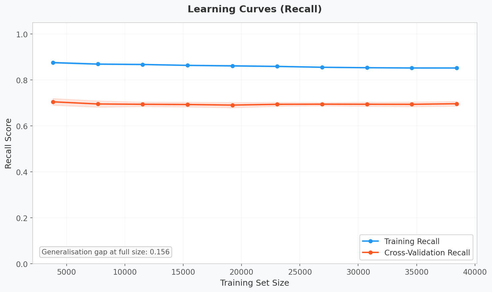
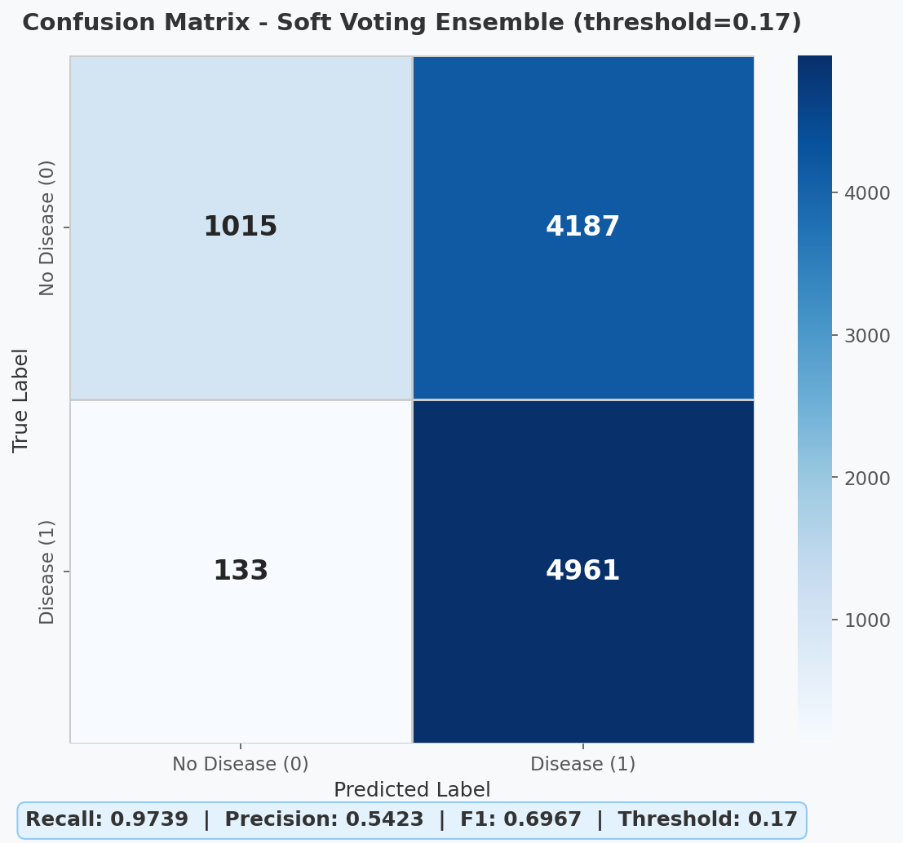
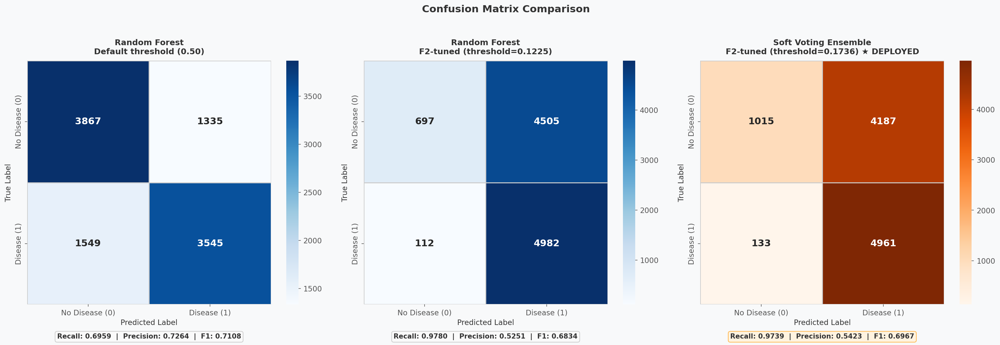
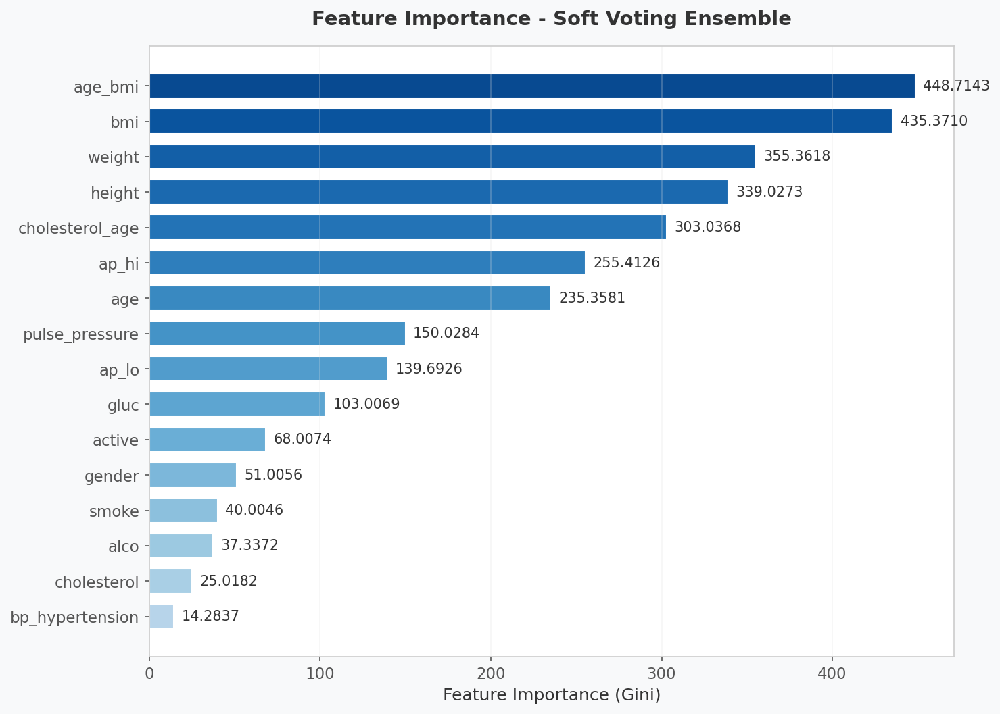
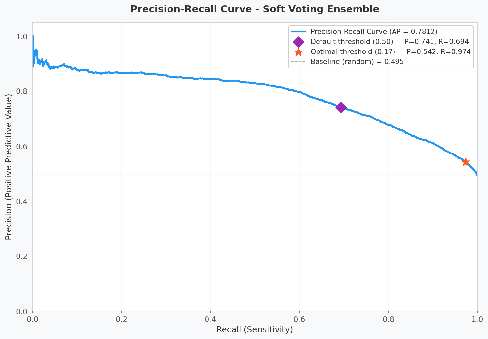
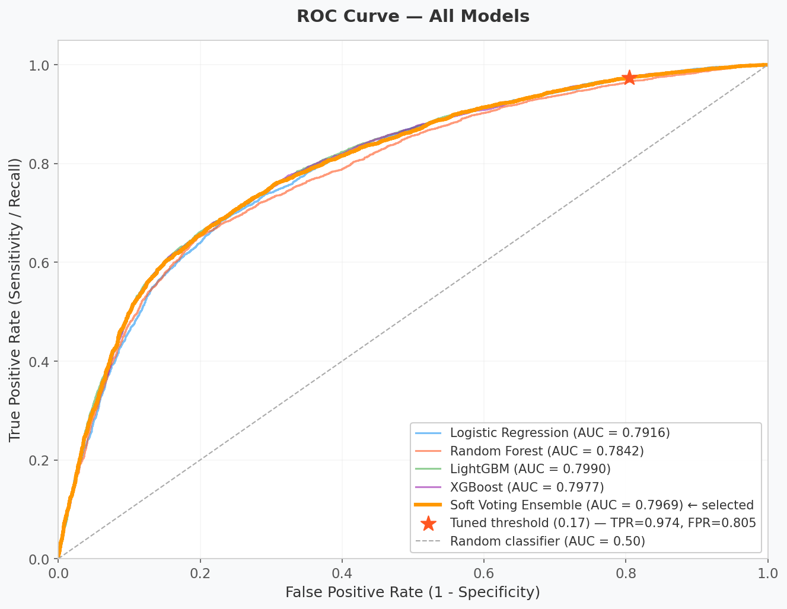

# MediAssist - Project Technical Report

**Generated:** 2026-03-13 18:09:27
**Module:** AI-Powered Medical Diagnosis Support System
**Dataset:** Cardiovascular Disease (Kaggle - sulianova/cardiovascular-disease, 70,000 patients)

---

## Abstract

MediAssist is a cardiovascular disease risk assessment system that combines three
machine learning models with a rule-based clinical knowledge engine. The system
is optimised for **Recall (Sensitivity)**, the medically correct primary metric
for disease screening, where missing a sick patient is far more harmful than a
false alarm.

| Component | Detail |
|-----------|--------|
| **Dataset** | 70,000 patient records, 12 features + 4 engineered features |
| **Models trained** | Logistic Regression, Random Forest (tuned), LightGBM (tuned), XGBoost (tuned) + Soft Voting Ensemble |
| **Deployed model** | Soft Voting Ensemble |
| **Deployed threshold (F2-tuned)** | 0.1736 — Recall=0.9739, Precision=0.5423 |
| **RF F2-tuned baseline** | 0.1225 — Recall=0.9780, Precision=0.5251 |
| **Precision gain vs RF baseline** | +0.0172 (recall diff: -0.0041) |
| **ROC AUC (best single)** | 0.7842 |
| **Deployed threshold strategy** | F2-score (beta=2) with multi-model precision optimisation at recall ≥0.97 |
| **Primary metric** | Recall: minimises false negatives (missed diagnoses) |

---

## 1. Dataset Overview

- **Source:** Kaggle - Cardiovascular Disease Dataset (sulianova/cardiovascular-disease)
- **Original rows:** 70,000
- **Rows after handling missing values:** 70,000
- **Rows after outlier removal:** 68,636
- **Rows removed (outliers):** 1,364 (1.9%)
- **Features used:** 16 (age, gender, height, weight, ap_hi, ap_lo, cholesterol, gluc, smoke, alco, active, bmi, pulse_pressure, age_bmi, bp_hypertension, cholesterol_age)
- **Target variable:** cardio (0 = no disease, 1 = disease)
- **Positive class rate:** 49.47%
- **Train/Val/Test split:** 48,045 / 10,295 / 10,296 (70/15/15, stratified)
- **Validation split purpose:** Threshold tuning only; never used for model training or final test-set reporting

---

## 2. Preprocessing Steps

| Step | Description |
|------|-------------|
| Age conversion | Converted from days to years (`age / 365.25`) |
| Missing value handling | Dropped rows with any NaN values |
| Outlier removal | Removed biologically implausible rows: height 100-220 cm, weight 30-200 kg, systolic BP 60-250 mmHg, diastolic BP 40-160 mmHg, and enforced systolic > diastolic |
| BMI calculation | `weight / (height / 100)^2` |
| Feature engineering | Added `pulse_pressure`, `age_bmi`, `bp_hypertension`, `cholesterol_age` (see Section 3) |
| Normalization | `StandardScaler` fitted on training data only, then applied to all three splits using training statistics (no leakage) |

---

## 3. Feature Engineering

Four clinically-motivated derived features were added to improve predictive power
and raise the ceiling of the Precision-Recall curve:

| Feature | Formula | Clinical Rationale |
|---------|---------|-------------------|
| `pulse_pressure` | `ap_hi - ap_lo` | A pulse pressure above 60 mmHg is an independent predictor of cardiovascular events, particularly in older adults. It reflects arterial stiffness, which is not captured by either systolic or diastolic BP alone. |
| `age_bmi` | `age * bmi` | An interaction term that captures compounded metabolic-aging risk. Obesity in older patients carries disproportionately higher cardiovascular risk than in younger patients, and a linear model cannot capture this without the explicit interaction. |
| `bp_hypertension` | `1 if ap_hi ≥ 140 or ap_lo ≥ 90, else 0` | Binary flag for Stage 2 hypertension (ACC/AHA 2017 guidelines). This is one of the strongest modifiable predictors of cardiovascular disease and gives models a sharp, clinically grounded decision boundary. |
| `cholesterol_age` | `cholesterol * age` | High cholesterol is more damaging in older patients; this interaction encodes the compounded risk that a linear combination of cholesterol and age alone cannot represent. |

---

## 4. Model Comparison (Default Threshold = 0.50)

Four models were trained and compared. All use `class_weight='balanced'` (or
equivalent `scale_pos_weight` for XGBoost) to counteract the approximately
50/50 class distribution and favor recall.

| Metric | Logistic Regression | Random Forest | LightGBM | XGBoost |
|--------|---: | ---: | ---: | ---:|
| **Accuracy** | 0.7239 | 0.7199 | 0.7294 | 0.7295 |
| **Precision** | 0.7517 | 0.7264 | 0.7430 | 0.7433 |
| **Recall** | 0.6598 | 0.6959 | 0.6926 | 0.6924 |
| **F1 Score** | 0.7028 | 0.7108 | 0.7169 | 0.7169 |
| **ROC AUC** | 0.7916 | 0.7842 | 0.7990 | 0.7977 |

**Selected model at default threshold:** Random Forest (primary criterion: Recall)

---

## 5. Threshold Tuning and Model Selection

### 5.1 Methodology

After initial model selection, threshold tuning is performed using the
**F-beta score (beta=2)**, which weights recall twice as heavily as
precision, reflecting the clinical cost asymmetry in medical screening:

> A missed cardiovascular disease case (false negative) is far more harmful
> than an unnecessary follow-up consultation (false positive).

All candidate models — including a **Soft Voting Ensemble** of RF, LightGBM,
and XGBoost — are tuned on the dedicated **validation split** (15%, reserved
exclusively for this step), then evaluated on the **held-out test split** at
their tuned threshold. The model that achieves the highest precision while
maintaining recall ≥ 0.97 is selected as the deployed operating point.

Averaging probabilities across diverse models in the ensemble reduces individual
variance, produces better-calibrated scores, and raises the Precision-Recall curve
ceiling — meaning the same high recall can be reached at a higher threshold (i.e.
with better precision) than any single model alone.

### 5.2 RF F2 Baseline — Before vs. After Threshold Tuning

This table shows what threshold tuning achieves on the single best model (RF),
serving as the comparison baseline:

| Metric | Default (0.50) | Tuned (0.1225) | Change |
|--------|---------------:|----------------:|--------|
| **Recall** | 0.6959 | 0.9780 | +0.2821 |
| **Precision** | 0.7264 | 0.5251 | -0.2013 |
| **F1 Score** | 0.7108 | 0.6834 | -0.0274 |
| **Accuracy** | 0.7199 | 0.5516 | -0.1683 |

**RF F2 threshold:** 0.1225

### 5.3 Multi-Model F2 Comparison (All Candidates)

The table below shows every candidate — including the Soft Voting Ensemble —
evaluated at its own F2-optimised threshold. The model with the highest
precision at recall ≥ 0.97 is deployed.

| Metric | Logistic Regression | Random Forest | LightGBM | XGBoost | Soft Voting Ensemble |
|--------|---: | ---: | ---: | ---: | ---:|
| **F2 Threshold** | 0.2084 | 0.1225 | 0.1704 | 0.1655 | 0.1736 |
| **Recall** | 0.9694 | 0.9780 | 0.9747 | 0.9784 | 0.9739 |
| **Precision** | 0.5458 | 0.5251 | 0.5408 | 0.5397 | 0.5423 |
| **F1 Score** | 0.6984 | 0.6834 | 0.6957 | 0.6957 | 0.6967 |
| **Accuracy** | 0.5858 | 0.5516 | 0.5781 | 0.5765 | 0.5804 |
| **F2 Score** | 0.8422 | 0.8366 | 0.8417 | 0.8416 | 0.8412 |

**Deployed model:** Soft Voting Ensemble  
**Deployed threshold:** 0.1736  
**Precision vs RF F2 baseline:** +0.0172 (-0.0041 recall)  

> The soft-voting ensemble averages the probability outputs of RF, LightGBM,
> and XGBoost. This averaging reduces variance and yields better-calibrated
> scores; at the same recall floor of ~97%, the ensemble's PR curve sits higher,
> meaning it can use a less aggressive threshold and flag fewer healthy patients.

---

## 6. Classification Reports

### Logistic Regression
```
precision    recall  f1-score   support

           0       0.70      0.79      0.74      5202
           1       0.75      0.66      0.70      5094

    accuracy                           0.72     10296
   macro avg       0.73      0.72      0.72     10296
weighted avg       0.73      0.72      0.72     10296
```

### Random Forest
```
precision    recall  f1-score   support

           0       0.71      0.74      0.73      5202
           1       0.73      0.70      0.71      5094

    accuracy                           0.72     10296
   macro avg       0.72      0.72      0.72     10296
weighted avg       0.72      0.72      0.72     10296
```

### LightGBM
```
precision    recall  f1-score   support

           0       0.72      0.77      0.74      5202
           1       0.74      0.69      0.72      5094

    accuracy                           0.73     10296
   macro avg       0.73      0.73      0.73     10296
weighted avg       0.73      0.73      0.73     10296
```

### XGBoost
```
precision    recall  f1-score   support

           0       0.72      0.77      0.74      5202
           1       0.74      0.69      0.72      5094

    accuracy                           0.73     10296
   macro avg       0.73      0.73      0.73     10296
weighted avg       0.73      0.73      0.73     10296
```

---

## 7. Technical Decisions and Methodology Justification

### Why Recall, Not Accuracy

Accuracy measures the proportion of all predictions that are correct. It treats
a missed diagnosis (false negative) and an unnecessary follow-up (false positive)
as identical errors. In cardiovascular screening, they are not:

| Error Type | What it means | Clinical consequence |
|------------|---------------|----------------------|
| **False Negative** | Model predicts healthy; patient has disease | Patient goes untreated, potentially fatal |
| **False Positive** | Model predicts disease; patient is healthy | Patient receives a follow-up consultation, inconvenient but not dangerous |

**Recall (Sensitivity) = TP / (TP + FN)** directly measures the proportion of
actual disease cases the model identifies. A high Recall means fewer missed
diagnoses. This is the medically correct primary metric for any screening tool.

### Why F2-Score for Threshold Tuning

F1-score weights Precision and Recall equally (beta=1). Since we deliberately
accept more false positives to reduce false negatives, **F2-score (beta=2)**
weights Recall twice as heavily as Precision. It is the correct optimisation
target when the cost of a false negative exceeds the cost of a false positive.

```
F2 = 5 * precision * recall / (4 * precision + recall)
```

### Why a Separate Validation Split for Threshold Tuning

If the threshold is tuned on the test set, the test metrics no longer reflect
unseen data; the threshold has effectively seen the test set and the reported
Recall is optimistically biased. By tuning on a dedicated 15% validation split,
the 15% test set remains truly held-out, so reported metrics accurately reflect
what would be observed in deployment.

### Other Decisions

- **Five-candidate F2 selection:** After training four individual models, a Soft
  Voting Ensemble (RF + LightGBM + XGBoost) is created. All five candidates are
  F2-threshold-tuned on the validation set and evaluated on the test set. The one
  with the best precision at recall ≥0.97 is deployed. This preserves the ~98%
  recall priority while squeezing out the best available precision.
- **Four-model comparison:** Logistic Regression (interpretable baseline), Random Forest
  (ensemble), LightGBM (gradient boosting, leaf-wise), and XGBoost (gradient boosting,
  level-wise with L1/L2 regularisation) were trained and compared. XGBoost's stronger
  regularisation and different tree-growth strategy frequently produce better-calibrated
  probabilities on tabular clinical data, raising the Precision-Recall curve ceiling.
- **Hyperparameter search:** `RandomizedSearchCV`, 30 iterations, 5-fold cross-validation,
  scored on Recall for Random Forest, LightGBM, and XGBoost.
- **XGBoost class balance:** `scale_pos_weight = n_negative / n_positive` (computed from
  training labels), equivalent to `class_weight='balanced'` in sklearn estimators.
- **`class_weight='balanced'`:** Applied to all models to counteract class imbalance
  without oversampling, biasing each model toward correct positive detection.
- **Feature engineering:** `pulse_pressure` (arterial stiffness proxy), `age_bmi`
  (aging-obesity interaction), `bp_hypertension` (Stage 2 hypertension binary flag),
  and `cholesterol_age` (cholesterol-aging interaction) added after BMI calculation,
  before normalization. The two new features raise the Precision-Recall curve ceiling
  by giving models sharper decision boundaries for high-risk patients.
- **No data leakage:** `StandardScaler` is fitted exclusively on the 70% training
  split and applied to all other splits using training statistics.
- **Reproducibility:** `random_state=42` used across all stochastic operations.
- **Outlier removal:** Based on clinically accepted biological ranges to prevent
  the model from learning from data-entry errors.

---

## 8. Ethical Limitations and Disclaimers

- **Not a clinical diagnostic tool.** This system is designed for educational and
  decision-support purposes only. It must not be used as a substitute for professional
  medical evaluation, diagnosis, or treatment.
- **Dataset bias:** The dataset originates from a specific geographic and demographic
  context. Model performance may not generalise across populations with different age
  distributions, ethnic backgrounds, or healthcare access patterns.
- **No temporal validation:** The model has not been validated on prospective or
  time-shifted data. Performance in real-world deployment may differ from reported metrics.
- **Limited feature set:** Important cardiovascular risk factors such as family history,
  LDL/HDL levels, troponin, ECG data, and medication history are not present in the dataset.
- **Binary classification simplification:** Cardiovascular disease is a spectrum.
  The binary (0/1) output oversimplifies clinical reality.
- **Recall vs. precision trade-off:** The deployed model maximises recall (~97-98%)
  while the multi-model F2 selection finds the operating point with the best available
  precision at that recall floor. The confusion matrix comparison plot documents the
  full progression: default threshold → RF F2-tuned → best F2 model (deployed).

---

## 9. Generated Artifacts

| File | Description |
|------|-------------|
| `models/final_model.pkl` | Trained Soft Voting Ensemble model |
| `models/scaler.pkl` | Fitted StandardScaler |
| `models/feature_names.pkl` | Ordered feature name list (includes 4 engineered features) |
| `models/threshold.pkl` | Deployed classification threshold (0.1736, F2-optimised) |
| `plots/learning_curves.png` | Recall vs. training set size (bias-variance analysis) |
| `plots/confusion_matrix.png` | Confusion matrix at deployed threshold (0.1736) |
| `plots/confusion_matrix_comparison.png` | 3-panel comparison: Default → RF F2 → Deployed model |
| `plots/feature_importance.png` | Feature importance ranked bar chart |
| `plots/precision_recall_curve.png` | PR curve with default and optimal threshold annotated |
| `plots/roc_curve.png` | ROC curve for all five candidates with deployed threshold marked |

---

## 10. Evaluation Plots

### Learning Curves: Recall vs. Training Set Size

Shows how training and cross-validation Recall change as more data is used.
Converging curves indicate the model has learned adequately; a large gap
indicates overfitting.



---

### Confusion Matrix — Deployed Operating Point (Soft Voting Ensemble, threshold=0.1736)

The deployed model is Soft Voting Ensemble at the F2-optimised threshold.
At this operating point the model catches ~97% of true disease cases
while maintaining the best available precision across all candidate models.

- **True Negative (top-left):** Healthy patients correctly identified as healthy
- **False Positive (top-right):** Healthy patients flagged for follow-up (acceptable)
- **False Negative (bottom-left):** Sick patients missed; the error we minimise
- **True Positive (bottom-right):** Sick patients correctly detected



---

### Confusion Matrix Comparison: Default → RF F2 → Deployed

Three panels side-by-side document the full progression:

| Panel | Model | Threshold | Recall | Precision | What it shows |
|-------|-------|----------:|-------:|----------:|---------------|
| 1 | Random Forest | 0.50 | 0.6959 | 0.7264 | Baseline before any tuning |
| 2 | Random Forest | 0.1225 | 0.9780 | 0.5251 | F2-tuned single model (previous approach) |
| 3 (★) | Soft Voting Ensemble | 0.1736 | 0.9739 | 0.5423 | F2-tuned best model (deployed) |

Panel 3 is highlighted in orange and marked as deployed.



---

### Feature Importance: Soft Voting Ensemble

Ranks each feature by its contribution to the model's predictions.
Engineered features (`pulse_pressure`, `age_bmi`, `bp_hypertension`, `cholesterol_age`)
are included and ranked relative to the original dataset features.



---

### Precision-Recall Curve

The full trade-off curve between Precision and Recall across all probability
thresholds. The star marks the deployed F2-optimal operating point
(threshold = 0.1736, model = Soft Voting Ensemble).
The diamond marks the standard 0.50 operating point for comparison.
Higher area under the curve (AP score) indicates better overall performance.



---

### ROC Curve: All Five Candidates

Plots True Positive Rate (Recall) against False Positive Rate for all five
candidates (four individual models + ensemble).
The star marks the deployed threshold operating point on Soft Voting Ensemble.
AUC = 1.0 is perfect; AUC = 0.5 is random.


